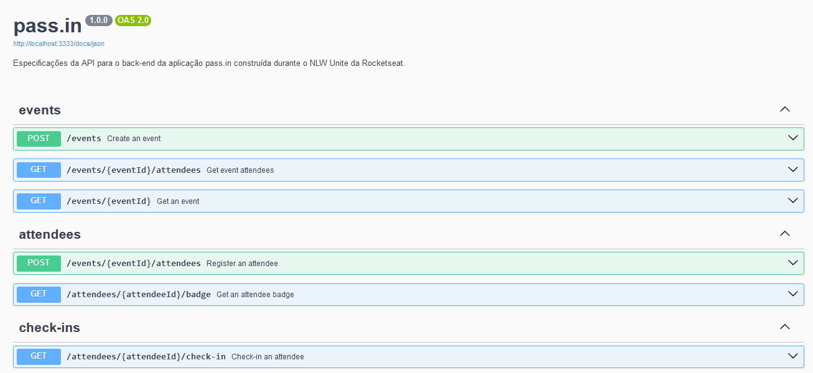

<p align="left">

  


  

</p>

### Tópicos

:small_blue_diamond: [Sobre o Projeto](#star-sobre-o-projeto)

:small_blue_diamond: [Objetivo](#dart-objetivo)

:small_blue_diamond: [Funcionalidades](#bookmark_tabs-funcionalidades)

:small_blue_diamond: [Como rodar a aplicação](#arrow_forward-como-rodar-a-aplicação)

## :star: Sobre o Projeto

Aplicação desenvolvida durante o NLW Unite, evento gratuito organizado pelo Rocketseat (https://www.rocketseat.com.br/).

Este projeto foi desenvolvido utilizando:

:heavy_check_mark: NodeJS

:heavy_check_mark: Prisma ORM + SQLite

:heavy_check_mark: ZOD

:heavy_check_mark: Fastify

:heavy_check_mark: Swagger


## :dart: Objetivo

O pass.in é um aplicativo de gestão de participantes em eventos presenciais.

## :bookmark_tabs: Funcionalidades

A API foi documentado utilizando Swagger. Para consultar a especificação acesse a rota "/docs" (http://localhost:3333/docs).




## :arrow_forward: Como rodar a aplicação

#### :heavy_check_mark: Clonando o Projeto

- No terminal, clone o projeto:

  ```
  https://github.com/dgo-angelo/nlw-unite-pass-in-server
  ```

### :arrow_forward: Executando a aplicação

- Acessar a pasta raiz do projeto e instalar as dependencias através do comando:

```
npm install
```

- Após instalar as dependencias, será necessário iniciar o server:

```
npm run dev
```